# Cluster Overview

Five-node bare-metal Talos Linux cluster (3 control-plane + 2 workers, scheduling allowed on all nodes). All state is declared in Git; nothing is applied imperatively post-bootstrap.

| Node | Hardware | Mgmt IP | Storage IP |
|------|----------|---------|-----------|
| talos-cp-01 | Minisforum MS-A2 (AMD Ryzen 9 9955HX, 16c/32t, 96GB ECC) | 10.60.0.201 | 10.200.0.201 |
| talos-cp-02 | Lenovo M90q Gen 1 (i5-10500T, 6c/12t, 64GB) | 10.60.0.202 | 10.200.0.202 |
| talos-cp-03 | Lenovo M90q Gen 1 (i5-10500T, 6c/12t, 64GB) | 10.60.0.203 | 10.200.0.203 |
| talos-worker-01 | Lenovo M920Q (i5-8500T, 6c, 32GB) | 10.60.0.204 | 10.200.0.204 |
| talos-worker-02 | Lenovo M920Q (i5-8600T, 6c, 64GB) | 10.60.0.205 | 10.200.0.205 |

**VIP**: `10.60.0.2` (kube-vip) | **CNI**: Cilium (kube-proxy replacement) | **DNS**: CoreDNS via HelmRelease

---

## Networks

| Subnet | Purpose |
|--------|---------|
| `10.60.0.0/24` | Management / Kubernetes API |
| `10.200.0.0/24` | Storage bond — Rook-Ceph cluster replication traffic |
| `10.42.0.0/16` | Pod network (Cilium) |
| `10.43.0.0/16` | Service network |

### Node NIC topology

All 5 nodes use a dedicated storage bond on the `10.200.0.0/24` subnet. This bond carries **Rook-Ceph cluster replication traffic** via `hostNetwork` OSDs (`cluster_network: 10.200.0.0/24`).

| Node | Management | Storage |
|------|------------|---------|
| talos-cp-01 | `enp4s0` — Intel I225-V (igc), `10.60.0.201/24` (+ kube-vip `10.60.0.2`) | `bond-storage` — 2× Intel X710 SFP+ (i40e) `enp5s0f0np0`+`enp5s0f1np1`, `10.200.0.201/24` |
| talos-cp-02 | `eno1` — Intel I219-LM (e1000e), `10.60.0.202/24` | `bond-storage` — 2× Intel X520-DA2 SFP+ (ixgbe) `enp2s0f0`+`enp2s0f1`, `10.200.0.202/24` |
| talos-cp-03 | `eno1` — Intel I219-LM (e1000e), `10.60.0.203/24` | `bond-storage` — 2× Intel X520-DA2 SFP+ (ixgbe) `enp2s0f0`+`enp2s0f1`, `10.200.0.203/24` |
| talos-worker-01 | `eno1` — Intel I219-LM (e1000e), `10.60.0.204/24` | `bond-storage` — 2× Intel X520-DA2 SFP+ (ixgbe) `enp1s0f0`+`enp1s0f1`, `10.200.0.204/24` |
| talos-worker-02 | `eno1` — Intel I219-LM (e1000e), `10.60.0.205/24` | `bond-storage` — 2× Intel X520-DA2 SFP+ (ixgbe) `enp1s0f0`+`enp1s0f1`, `10.200.0.205/24` |

All 5 storage bonds run **802.3ad LACP** (fast rate, `layer3+4` hash policy) at **MTU 9000 (jumbo frames)**, aggregating to a 20 Gbit/s link per node (`speedMbit: 20000` on the bond master). Management interfaces run at MTU 1500. cp-01 also has an unused `enp3s0` (RTL8125B, r8169) that is down.

> **2026-06-18:** cp-02 and cp-03 each had an Intel X520-DA2 SFP+ 10GbE card added, replacing their previous `eno1.200` VLAN-200 storage trunk (single 1GbE NIC, MTU 1500). Cut over to `bond-storage` live with zero pod restarts on the affected mon/OSD pods; briefly surfaced `OSD_SLOW_PING_TIME_BACK`/`_FRONT` warnings (MAC-table/ARP relearning on the switch after the interface swap) that self-cleared within ~1 minute back to `HEALTH_OK`.

> etcd peer traffic is restricted to the management subnet (`advertisedSubnets: ["10.60.0.0/24"]`) — it never crosses the storage VLAN.

---

## Running Components

**Talos v1.13.2 / Kubernetes v1.36.1.** All Helm-deployed components are installed via Helmfile during bootstrap (`bootstrap/helmfile.d/01-apps.yaml`); version pins are tracked by Renovate.

### Kubernetes control plane · `kube-system`

Managed by Talos as **static pods** — one instance per control-plane node, no Helm chart involved. Talos regenerates these pods from `talconfig.yaml`; never edit their manifests directly.

| Component | Version | Replicas | Role |
|-----------|---------|----------|------|
| `kube-apiserver` | v1.36.1 | 3 (one/CP node) | REST gateway for all cluster operations; the authoritative source of cluster state |
| `kube-controller-manager` | v1.36.1 | 3 (one/CP node) | Runs built-in reconciliation loops — Deployments, ReplicaSets, node lifecycle, service accounts |
| `kube-scheduler` | v1.36.1 | 3 (one/CP node) | Assigns pending Pods to nodes based on resources, affinity rules, and taints |
| `etcd` | v3.6.11 (Talos-managed) | 3 (one/CP node) | Distributed key-value store holding all cluster state; runs as a Talos service, not a pod |

> **kube-proxy is not running.** Cilium replaces it entirely (`kubeProxyReplacement: true`).

---

### Cilium · `v1.19.4` · `kube-system`

**CNI (Container Network Interface)** — the cluster's network data-plane. Installed via Helmfile; values in `kubernetes/apps/kube-system/cilium/app/helm/values.yaml`.

| Pod | Type | Replicas | Role |
|-----|------|----------|------|
| `cilium` | DaemonSet | 5 (one/node) | Per-node agent that programs eBPF maps for pod networking, kube-proxy replacement, and network policy enforcement |
| `cilium-envoy` | DaemonSet | 5 (one/node) | Envoy proxy sidecar used by Cilium for L7-aware network policies and observability |
| `cilium-operator` | Deployment | 1 | Cluster-wide control-plane for Cilium — manages IP allocation (IPAM), CiliumNode objects, and Helm lifecycle |
| `cilium-secrets` namespace | — | — | Holds TLS material for Cilium's mutual-auth features; created and owned by the Cilium Helm chart |

**L2 LoadBalancer (ARP)** — two CRDs in `kube-system` make `LoadBalancer`-type Services reachable on the management LAN without an external load balancer:

| Resource | Kind | Detail |
|----------|------|--------|
| `pool` | `CiliumLoadBalancerIPPool` | IP range `10.60.0.230–10.60.0.249` — allocated to `LoadBalancer` Services by Cilium IPAM |
| `l2-policy` | `CiliumL2AnnouncementPolicy` | Announces LoadBalancer IPs via ARP on all interfaces of every Linux node; storage bonds are on an isolated L2 so spurious ARP on them is harmless |

Gateways request specific IPs from this pool via the `lbipam.cilium.io/ips` annotation.

---

### CoreDNS · `v1.45.2` (chart) · `kube-system`

**Cluster DNS.** Resolves `<service>.<namespace>.svc.cluster.local` names for all pods. Installed via Helmfile with image pulled from `mirror.gcr.io/coredns/coredns` (avoids Docker Hub rate limits). Talos's built-in CoreDNS is disabled — this Helm-managed instance is the sole DNS server.

| Pod | Type | Replicas | Role |
|-----|------|----------|------|
| `coredns` | Deployment | 5 (1/node) | DNS server; handles in-cluster service discovery and forwards external queries upstream |

> **Topology spread**: 1 CoreDNS pod per node (`DoNotSchedule`). A single-node failure does not degrade cluster DNS.

---

### Spegel · `v0.7.1` · `kube-system`

**P2P container image mirror.** Each node runs a Spegel agent that advertises locally-cached image layers to the other nodes via a peer-to-peer registry protocol. When a node pulls an image already present on a sibling node, it fetches layers locally over the cluster network instead of from the public registry — reducing pull latency and external bandwidth, and making the cluster resilient to registry outages.

| Pod | Type | Replicas | Role |
|-----|------|----------|------|
| `spegel` | DaemonSet | 5 (one/node) | Per-node OCI registry mirror; participates in P2P layer distribution |

---

### metrics-server · `v3.13.0` (chart) · `kube-system`

**Resource metrics provider.** Exposes CPU and memory usage for nodes and pods via the Kubernetes Metrics API (`metrics.k8s.io/v1beta1`), enabling `kubectl top nodes/pods` and `HorizontalPodAutoscaler`. Managed by Flux HelmRelease via OCIRepository.

| Pod | Type | Replicas | Role |
|-----|------|----------|------|
| `metrics-server` | Deployment | 1 | Scrapes the kubelet Summary API on each node and serves aggregated resource metrics |

---

### cert-manager · `v1.20.2` · `cert-manager`

**Certificate lifecycle manager.** Issues and renews X.509 certificates inside the cluster via `Certificate` and `Issuer`/`ClusterIssuer` CRDs. Two `ClusterIssuer` resources are live: `letsencrypt-staging` and `letsencrypt-production`, both using ACME DNS-01 challenge via Cloudflare. The Cloudflare API token is sourced from 1Password via an `ExternalSecret`.

| Pod | Replicas | Role |
|-----|----------|------|
| `cert-manager` | 2 | Core controller — watches `Certificate` objects, triggers issuance/renewal via the configured issuer |
| `cert-manager-cainjector` | 2 | Injects CA bundles into `MutatingWebhookConfiguration` and `ValidatingWebhookConfiguration` objects so Kubernetes trusts cert-manager's own webhooks |
| `cert-manager-webhook` | 2 | Admission webhook that validates and mutates cert-manager CRD objects at creation time |

> **Topology spread**: all three components share the `app.kubernetes.io/instance: cert-manager` label. 6 pods spread across 5 nodes via `DoNotSchedule`. A node failure causes leader-election failover (~60 s for controller/cainjector); the webhook has zero downtime (both replicas always serve).

> **Live wildcard certificates.** Four `Certificate` objects in the `network` namespace cover the cluster's domains — `wildcard-cluster-vwn-io` (`cluster.vwn.io` / `*.cluster.vwn.io`), `wildcard-apps-vwn-io` (`apps.vwn.io` / `*.apps.vwn.io`), `wildcard-vwn-app` (`vwn.app` / `*.vwn.app`), `wildcard-vwn-casa` (`vwn.casa` / `*.vwn.casa`). All four issued by `letsencrypt-production`, valid through `2026-09-14`, auto-renewing via DNS-01. Secrets: `network/{cluster-vwn-io,apps-vwn-io,vwn-app,vwn-casa}-tls` — referenced via `certificateRefs` on both Gateways' `https` listener.

> **Staging vs production issuers.** Always use `letsencrypt-staging` when first wiring up a new app or testing DNS-01 challenge configuration. Staging issues certificates from Let's Encrypt's untrusted fake root — browsers reject them, but the entire issuance flow (Cloudflare DNS record creation, ACME challenge, certificate delivery, renewal) is identical to production. This avoids burning against production's rate limits (5 duplicate certificates/week per domain). Once staging issues successfully, switch `clusterIssuerName` to `letsencrypt-production`.
>
> Example `Certificate` resource using the staging issuer:
> ```yaml
> apiVersion: cert-manager.io/v1
> kind: Certificate
> metadata:
>   name: my-app-tls
>   namespace: my-app
> spec:
>   secretName: my-app-tls
>   issuerRef:
>     name: letsencrypt-staging   # switch to letsencrypt-production once verified
>     kind: ClusterIssuer
>   dnsNames:
>     - my-app.${cluster_domain}  # substituted from cluster-settings ConfigMap
> ```

---

### Envoy Gateway · `v1.8.0` · `network`

**Gateway API ingress controller.** Implements the Kubernetes Gateway API (`gateway.networking.k8s.io/v1`) — the upstream successor to `Ingress` — to route external and internal HTTPS traffic into the cluster. Managed by Flux HelmRelease from an OCIRepository (`docker.io/envoyproxy/gateway-helm`); Renovate tracks the image tag.

The Gateway API splits concerns into three levels: `GatewayClass` (which controller handles traffic) → `Gateway` (what IP/port/TLS to listen on) → `HTTPRoute` (how to route a specific hostname/path to a Service). This lets multiple Gateways (external, internal) share one controller binary, and lets app teams own their `HTTPRoute` without touching shared infrastructure. The `GatewayNamespace` deploy mode means Envoy proxy pods are created in the same namespace as their `Gateway` object (`network`), isolating the data-plane from `kube-system`.

| Resource | Kind | Detail |
|----------|------|--------|
| `envoy` | `GatewayClass` | Cluster-wide class backed by the `EnvoyProxy` config in the `network` namespace |
| `envoy` | `EnvoyProxy` | 3-replica Envoy deployment per Gateway (1/node); `externalTrafficPolicy: Local`; Prometheus metrics enabled; 60 s drain on shutdown |
| `envoy-external` | `Gateway` | Pinned to `10.60.0.230`; HTTP port 80 (redirect only) + HTTPS port 443 for `*.${CLUSTER_DOMAIN}`; routes from any namespace |
| `envoy-internal` | `Gateway` | Pinned to `10.60.0.231`; same listener config as external; separate IP for internal-only services |
| `envoy` | `ClientTrafficPolicy` | TLS 1.2 min; h2+http/1.1 ALPN; X-Forwarded-For trusted from pod CIDR (`10.42.0.0/16`) for Cloudflare Tunnel real-IP propagation |

Both Gateways reference the same four wildcard TLS secrets (`cluster-vwn-io-tls`, `apps-vwn-io-tls`, `vwn-app-tls`, `vwn-casa-tls`) on their `https` listener for TLS termination. HTTP requests on port 80 receive a 301 redirect to HTTPS on both Gateways via dedicated `HTTPRoute` resources.

> **Adding a new app**: see [Exposing Services (HTTPRoute Workflow)](#exposing-services-httproute-workflow) below for the full step-by-step process covering internal-only, external, and dual-access scenarios.

---

### Cloudflare Tunnel (cloudflared) · `2026.5.2` · `network`

**Outbound tunnel to Cloudflare's edge.** Two cloudflared replicas maintain persistent encrypted connections to Cloudflare's network, making `*.${CLUSTER_DOMAIN}` reachable externally without port forwarding, a static external IP, or firewall rules. All inbound external traffic is forwarded to the `envoy-external` Gateway (`10.60.0.230`). Managed by Flux HelmRelease via the `bjw-s/app-template` OCIRepository.

| Pod | Type | Replicas | Role |
|-----|------|----------|------|
| `cloudflared` | Deployment | 2 | Maintains persistent HTTP/2 connections to Cloudflare edge; forwards inbound requests to `envoy-external` |

The tunnel ingress config (mounted from a ConfigMap) routes `*.${CLUSTER_DOMAIN}` and `${CLUSTER_DOMAIN}` to `https://envoy-external.network.svc.cluster.local`. Tunnel credentials (`TUNNEL_TOKEN`) are sourced from 1Password via `ExternalSecret` (`cloudflared` item, `TOKEN` field).

> **DNS**: `*.${CLUSTER_DOMAIN}` and `${CLUSTER_DOMAIN}` are Cloudflare-proxied CNAMEs pointing at the tunnel endpoint (`<tunnel-id>.cfargotunnel.com`). These are managed by ExternalDNS (see below).

---

### ExternalDNS · `v1.21.1` (chart) · `network`

**Automated DNS record management.** Two independent instances keep DNS in sync with cluster state — no manual record creation is needed when adding `HTTPRoute` or `LoadBalancer` services.

| Instance | Provider | Sources | Scope |
|----------|----------|---------|-------|
| `external-dns-cloudflare` | Cloudflare API (proxied) | `gateway-httproute`, `DNSEndpoint` CRD | `${CLUSTER_DOMAIN}` — creates proxied CNAME records for external-facing routes via `envoy-external` |
| `external-dns-unifi` | UniFi webhook sidecar (`kashalls/external-dns-unifi-webhook`) | `gateway-httproute`, `Service` | `${CLUSTER_DOMAIN}` + `home.arpa` — creates A records for all gateways and LoadBalancer services on the local LAN |

Both instances use `policy: sync` (records deleted when the resource is removed) and a `k8s.` TXT prefix to avoid collision. Cloudflare API token and UniFi credentials are sourced from 1Password via `ExternalSecret`.

---

### Tailscale · `v1.96.5` (operator image) · `tailscale`

**Mesh VPN remote access.** The Tailscale Kubernetes operator exposes the management LAN (`10.60.0.0/24`) to other devices on the user's tailnet via a subnet router — no inbound port forwarding required. Installed via Flux HelmRelease (`chartRef` → OCIRepository `tailscale-operator`, version tracked there); the tailnet auth key is sourced from 1Password via `ExternalSecret`.

| Pod | Type | Replicas | Role |
|-----|------|----------|------|
| `operator` | Deployment | 1 | Watches `Connector`/`ProxyClass` CRDs; provisions subnet-router StatefulSets on demand |
| `ts-subnet-router-*` | StatefulSet (Tailscale-managed) | 1 | Advertises `10.60.0.0/24` as a subnet route to the tailnet |

> A `Connector` CR (`subnet-router`) declares the advertised route. Complements rather than duplicates the Cloudflare Tunnel: Tailscale gives the user's own devices private, authenticated LAN access; cloudflared gives the public internet HTTPS access to specific routed hostnames.

---

## Exposing Services (HTTPRoute Workflow)

All cluster endpoints are wired via **Gateway API** (`HTTPRoute`), not classic `Ingress`. The routing, DNS creation, and TLS termination are all automatic once you create an `HTTPRoute` — no certificate requests, no DNS annotations, no firewall rules needed.

### The two gateways

| Gateway | IP | Access |
|---|---|---|
| `envoy-external` | `10.60.0.230` | WAN + LAN — sits behind the cloudflared tunnel |
| `envoy-internal` | `10.60.0.231` | LAN only — no tunnel, not reachable from the public internet |

Both gateways share pre-issued wildcard TLS certificates (in the `network` namespace). TLS terminates at the gateway; `HTTPRoute` objects never need to reference certificates.

### Domain convention

| Variable | Domain | Routed externally? |
|---|---|---|
| `${DOMAIN_CLUSTER}` | `cluster.vwn.io` | No — absent from cloudflared config; internal-only |
| `${DOMAIN_IO}` | `vwn.io` | Yes — covered by cloudflared tunnel |
| `${DOMAIN_APP}` | *(encrypted)* | Yes — covered by cloudflared tunnel |
| `${DOMAIN_CASA}` | *(encrypted)* | Yes — covered by cloudflared tunnel |
| `${DOMAIN_APPS}` | *(encrypted)* | Yes — covered by cloudflared tunnel |

Use `${DOMAIN_CLUSTER}` for internal-only services. Use any of the other domains for services that should be reachable from the internet.

### Scenario 1 — Internal only (LAN)

Attach to `envoy-internal` with a `${DOMAIN_CLUSTER}` hostname. Example for the Longhorn UI:

```yaml
# kubernetes/apps/longhorn-system/longhorn/app/httproute.yaml
---
apiVersion: gateway.networking.k8s.io/v1
kind: HTTPRoute
metadata:
  name: longhorn
spec:
  parentRefs:
    - name: envoy-internal
      namespace: network
      sectionName: https
  hostnames:
    - "longhorn.${DOMAIN_CLUSTER}"
  rules:
    - backendRefs:
        - name: longhorn-frontend
          port: 80
```

What happens automatically:
- `external-dns-unifi` creates a DNS record in UniFi: `longhorn.cluster.vwn.io → CNAME internal.proxii.nl → 10.60.0.231`
- `external-dns-cloudflare` does **not** act — it only watches `envoy-external`
- TLS is handled by the pre-existing `cluster-vwn-io-tls` wildcard on the gateway

### Scenario 2 — External (WAN + LAN)

Attach to `envoy-external` with a hostname under any cloudflared-routed domain:

```yaml
spec:
  parentRefs:
    - name: envoy-external
      namespace: network
      sectionName: https
  hostnames:
    - "myapp.${DOMAIN_IO}"
```

What happens automatically:
- `external-dns-cloudflare` creates a proxied CNAME in Cloudflare: `myapp.vwn.io → external.vwn.io`
- `external-dns-unifi` creates a LAN DNS record so traffic from inside the network bypasses Cloudflare
- WAN flow: `browser → Cloudflare CDN → cloudflared tunnel → envoy-external → service`
- LAN flow: `browser → UniFi DNS → 10.60.0.230 (envoy-external) → service`

### Scenario 3 — Dual access (same service on both internal and external)

Use two `parentRefs` in a single `HTTPRoute`. Both ExternalDNS instances pick it up independently:

```yaml
spec:
  parentRefs:
    - name: envoy-external
      namespace: network
      sectionName: https
    - name: envoy-internal
      namespace: network
      sectionName: https
  hostnames:
    - "myapp.${DOMAIN_IO}"
```

Alternatively, use two separate `HTTPRoute` objects with different hostnames pointing at the same backend Service.

### Scenario 4 — LAN resource proxy (external services)

To expose a LAN host (Proxmox, NAS, home appliance) via a cluster domain, use a headless `Service` backed by a manual `EndpointSlice`. No pod is involved — `envoy-internal` reverse-proxies requests to the static LAN IP.

```yaml
# endpoint.yaml — static LAN IP; label binds EndpointSlice to the Service
apiVersion: discovery.k8s.io/v1
kind: EndpointSlice
metadata:
  name: proxmox
  labels:
    kubernetes.io/service-name: proxmox
    endpointslice.kubernetes.io/managed-by: proxmox
addressType: IPv4
endpoints:
  - addresses: ["10.60.0.10"]
    conditions: { ready: true }
ports:
  - name: http
    port: 8006
---
# service.yaml — no selector; backed by the EndpointSlice above
apiVersion: v1
kind: Service
metadata:
  name: proxmox
spec:
  ports:
    - name: http
      port: 8006
      targetPort: 8006
---
# httproute.yaml
apiVersion: gateway.networking.k8s.io/v1
kind: HTTPRoute
metadata:
  name: proxmox
spec:
  hostnames: ["proxmox.${DOMAIN_CLUSTER}"]
  parentRefs:
    - name: envoy-internal
      namespace: network
      sectionName: https
  rules:
    - backendRefs:
        - name: proxmox
          port: 8006
```

Group all LAN services under `kubernetes/apps/network/external-services/` — one subdirectory per service, each with its own Flux `Kustomization` in a multi-document `ks.yaml`. TLS terminates at `envoy-internal` using the pre-loaded `cluster-vwn-io-tls` wildcard; the backend connection is plaintext HTTP to the LAN host.

> **Live external-services**: `truenas` (TrueNAS web UI) and `wan-failover` are both deployed under this pattern today — useful as working reference examples when adding a new LAN proxy.

> **TLS passthrough (end-to-end HTTPS):** requires a `TLS: Passthrough` listener on `envoy-internal` and a `TLSRoute` instead of an `HTTPRoute`. A future dedicated `envoy-services` gateway avoids adding this listener to `envoy-internal` — see [ROADMAP.md → Dedicated envoy-services Gateway](../docs/ROADMAP.md).

### Checklist for any new endpoint

1. Create `httproute.yaml` in the app's `app/` directory
2. Choose gateway: `envoy-internal` (LAN only) or `envoy-external` (WAN + LAN)
3. Choose domain: `${DOMAIN_CLUSTER}` for internal-only; any other domain for external
4. Add `httproute.yaml` to the app's `app/kustomization.yaml` resources list
5. No TLS config needed — wildcard certs are pre-loaded on both gateways
6. No ExternalDNS annotation needed — both instances auto-discover from `gateway-httproute` source

> **No `ReferenceGrant` required.** Both gateways set `allowedRoutes.namespaces.from: All` on their `https` listeners, so `HTTPRoute` objects in any namespace can attach without an extra `ReferenceGrant` object.

---

### External Secrets Operator · `v2.5.0` · `external-secrets`

**Application secret management.** Pulls secret values from 1Password and creates native Kubernetes `Secret` objects inside the cluster. Three components work together:

| Component | Replicas | Role |
|-----------|----------|------|
| `external-secrets` (ESO) | 2 | Operator that watches `ExternalSecret` objects and reconciles their values from the configured store |
| `external-secrets-webhook` | 2 | Admission webhook that validates ESO CRD objects at creation time |
| `external-secrets-cert-controller` | 2 | Manages TLS certificates for the ESO webhook |
| `onepassword-connect` | 1 | Local 1Password Connect server running in-cluster; proxies secret requests to the 1Password cloud API |
| `onepassword-store` (`ClusterSecretStore`) | — | ESO store resource named `onepassword` — the reference apps use in `ExternalSecret.spec.secretStoreRef` |

> **Topology spread**: all three ESO pods share `app.kubernetes.io/instance: external-secrets`. 6 pods spread across 5 nodes via `DoNotSchedule`. ESO runs in **concurrent mode** (no leader election) — both controller replicas are always active simultaneously; a node failure causes zero-delay failover.

Apps define an `ExternalSecret` object pointing at the `onepassword` store and a specific item/field path. ESO resolves the value at reconcile time and writes it into a Kubernetes `Secret` in the app's namespace. Secret values never touch Git.

> The 1Password Connect credentials (`1password-credentials.json`) are stored as a SOPS-encrypted `Secret` in the `external-secrets` namespace and mounted into the Connect server pod.

---

### FluxCD · operator `v0.50.0` · `flux-system`

**GitOps engine.** Continuously reconciles the cluster state against this Git repository. Installed in two layers: `flux-operator` (Helm chart, manages the Flux controllers) and `flux-instance` (a `FluxInstance` CR that wires Flux to the repo). After bootstrap, Flux owns its own Helm values files — the operator re-reconciles itself from Git.

| Pod | Replicas | Role |
|-----|----------|------|
| `flux-operator` | 1 | Lifecycle manager for Flux — installs, upgrades, and health-checks the four core Flux controllers |
| `source-controller` | 1 | Fetches sources (GitRepository, HelmRepository, OCIRepository) and makes their content available to other controllers |
| `kustomize-controller` | 2 | Applies Kustomization objects — renders and `kubectl apply`s manifests from Git paths |
| `helm-controller` | 2 | Reconciles `HelmRelease` objects — installs/upgrades Helm charts from sources |
| `notification-controller` | 2 | Handles `Alert` and `Receiver` objects for event-driven reconciliation triggers and outbound notifications |

> **Topology spread**: helm-controller, kustomize-controller, and notification-controller share the pod label `app.kubernetes.io/part-of: flux` (injected via kustomize patch). 6 pods spread across 5 nodes via `DoNotSchedule`. A node failure causes leader-election failover within ~35 s (Flux lease duration). source-controller and flux-operator are intentionally excluded: source-controller's artifact HTTP server only starts on the leader so non-leader replicas are permanently NotReady; flux-operator manages the FluxInstance CR only and has no HA value.

> **Reconciliation alerting (`flux-alerts`).** A Flux `Provider` (`alertmanager`, pointing at the in-cluster `kube-prometheus-stack-alertmanager` service) and an `Alert` (`flux-errors`, `eventSeverity: error` across all Kustomizations + HelmReleases) live in `flux-system` — see `kubernetes/apps/flux-system/flux-alerts/`. This forwards reconciliation failures into Alertmanager. ⚠️ **Outbound delivery is not yet wired**: Alertmanager has no receiver/route configured, so alerts currently terminate at its default `null` receiver and do not reach a human. See [REPO-AUDIT.md](REPO-AUDIT.md) finding **W1** and [ROADMAP.md → Alertmanager Receiver](ROADMAP.md#alertmanager-receiver).

---

### Rook-Ceph · `v1.19.6` (operator chart) · `rook-ceph`

**Distributed block storage.** Provides the `ceph-block` StorageClass (default cluster StorageClass) for replicated `ReadWriteOnce` PVCs across nodes using dedicated NVMe drives. Managed by Flux HelmRelease; values in `kubernetes/apps/rook-ceph/`. Longhorn was removed during the Rook-Ceph migration (commit `8b27593`).

| Pod | Type | Role |
|-----|------|------|
| `rook-ceph-operator` | Deployment | Watches `CephCluster`, `CephBlockPool`, etc. and manages the full Ceph lifecycle |
| `rook-ceph-mon-{a,b,c}` | Deployment (3) | Ceph monitor daemons — provide quorum and cluster map; `hostNetwork` on the management subnet (`10.60.0.0/24`) |
| `rook-ceph-osd-{0..8}` | Deployment (9) | 2 logical OSDs per NVMe on cp-01/cp-02/cp-03/worker-01 (`osdsPerDevice: 2`); 1 OSD on worker-02 (per-node override — its disk is half the others' size, see comment in the HelmRelease); `hostNetwork` with `cluster_network: 10.200.0.0/24` for replication traffic |
| `rook-ceph-mgr-{a,b}` | Deployment (2) | Ceph manager — Prometheus metrics, dashboard, orchestration modules |
| `rook-ceph-dashboard` | Service | Ceph dashboard UI (admin password from 1Password via ExternalSecret) |
| CSI components | DaemonSets/Deployments | RBD CSI driver (`csi-rbdplugin`) + provisioner sidecars |

> **Pool settings**: `size=3`, `min_size=2`, `deviceClass: nvme`. 9 OSDs across all 5 nodes (8.2 TiB raw) — cp-01/cp-02/cp-03/worker-01 each run 2 logical OSDs from a 2TB NVMe (`osdsPerDevice: 2`); worker-02 runs 1 OSD from its smaller 1TB NVMe. The `ceph-block` StorageClass is the cluster default — all new PVCs use it unless otherwise specified.
>
> **worker-02 onboarded 2026-06-18.** Its Kingston `nvme0n1` had been mistakenly excluded since commit `36f6c77` (which misidentified it as the boot disk — the real system disk is `nvme1n1`). Wiped a stale `lvm2-pv` signature left over from a defunct cluster FSID (`vgchange -an` + `wipefs -a`, no reboot needed, node stayed live throughout) and added it to `storage.nodes`; `osd.8` joined cleanly, cluster reached `HEALTH_OK` with all 33 PGs `active+clean` within under a minute.

---

### OpenEBS · `v4.4.0` · `openebs`

**Local hostpath storage.** Provides the `openebs-hostpath` StorageClass for single-node `ReadWriteOnce` PVCs backed by local NVMe (non-replicated). Managed by Flux HelmRelease.

| Pod | Type | Role |
|-----|------|------|
| `openebs-localpv-provisioner` | Deployment | Dynamically provisions hostpath PVs on the local node |

> **Per-node capacity is uneven.** Each node's `local-hostpath` UserVolume (`talos/patches/node/machine-volumes-1tb.yaml`) fills the system disk after a 120GiB `EPHEMERAL` cap. cp-01, cp-02, worker-01, and worker-02 have ~1TB system disks → ~870-890 GiB available each. **cp-03's system disk is only 256GB → ~125 GiB available** — the patch is applied uniformly across all 5 nodes despite the size mismatch. `openebs-hostpath` (`WaitForFirstConsumer`, `openebs.io/local`) has no node-capacity awareness — the provisioner follows wherever the pod scheduled, with no fallback if that node is low on space. Avoid scheduling large `openebs-hostpath` PVCs (e.g. >50 GiB) without node anti-affinity away from cp-03; prefer `ceph-block` for anything sizeable.

---

### kube-prometheus-stack · `v86.1.0` (chart) · `observability`

**Cluster monitoring stack.** Deploys Prometheus, Alertmanager, Grafana, kube-state-metrics, and node-exporter as a unified stack. Full-cluster scraping is configured via `ServiceMonitor` and `PodMonitor` CRDs. `ceph-block` PVCs provide persistence for Prometheus (20 GiB) and Alertmanager (1 GiB). Grafana is **enabled** and runs in-stack (admin credentials sourced from 1Password via `ExternalSecret`).

| Component | Type | Replicas | Role |
|-----------|------|----------|------|
| `kube-prometheus-stack-operator` | Deployment | 1 | Watches `ServiceMonitor`, `PodMonitor`, `PrometheusRule` CRDs and manages Prometheus config |
| `prometheus-kube-prometheus-stack-prometheus` | StatefulSet | 1 | Time-series metrics store; scrapes all targets defined by monitors |
| `alertmanager-kube-prometheus-stack-alertmanager` | StatefulSet | 1 | Deduplicates, groups, and routes alerts from Prometheus rules |
| `kube-prometheus-stack-kube-state-metrics` | Deployment | 1 | Exposes Kubernetes object state as Prometheus metrics |
| `kube-prometheus-stack-prometheus-node-exporter` | DaemonSet | 5 (one/node) | Exposes per-node hardware and OS metrics |
| `kube-prometheus-stack-grafana` | Deployment | 1 | Visualisation/dashboards over Prometheus; admin password from 1Password via `ExternalSecret` |

---

### smartctl-exporter · `v0.16.1` (chart) · `observability`

**Disk SMART metrics exporter.** A per-node DaemonSet that reads SMART attributes from the NVMe drives via `smartctl` and exposes them as Prometheus metrics (temperature, wear, error counters), feeding the hardware-temperature `PrometheusRule` alerts added in the `hardware-monitoring` session.

| Pod | Type | Replicas | Role |
|-----|------|----------|------|
| `smartctl-exporter` | DaemonSet | 5 (one/node) | Scrapes NVMe SMART data on each node; privileged access to block devices |

---

### tuppr · `v0.1.36` · `system-upgrade`

**GitOps upgrade controller.** Watches `TalosUpgrade` and `KubernetesUpgrade` CRDs and performs rolling upgrades node-by-node. Triggered by Renovate PRs that bump version fields in `talenv.yaml` and `kubernetesupgrade.yaml`. Managed by Flux HelmRelease.

| CRD | Current | Role |
|-----|---------|------|
| `TalosUpgrade/cluster` | v1.13.2 | Tracks target Talos version; drives `talosctl upgrade` per node |
| `KubernetesUpgrade/kubernetes` | v1.36.1 | Tracks target Kubernetes version; drives `talosctl upgrade-k8s` |

### Actions Runner Controller (ARC) · `v0.14.2` · `actions-runner-system`

**GitHub Actions self-hosted runner pool.** ARC provisions ephemeral Kubernetes pod runners on demand via the scale set pattern. Two HelmReleases work together: the cluster-wide controller and the `home-lab` runner scale set scoped to this repository.

| Component | Type | Replicas | Role |
|-----------|------|----------|------|
| `actions-runner-controller` (gha-rs-controller) | Deployment | 1 | Cluster-wide controller that manages scale sets and creates runner pods on demand |
| `home-lab` listener | Pod (ephemeral) | 1 (scales to 0 when idle) | Listens for queued GitHub Actions jobs; spins up runner pods per job; each pod uses a 25 Gi `openebs-hostpath` work volume |

Runner pods are launched with `cluster-admin` RBAC and a Talos `ServiceAccount` (`os:admin`) mounted at `/var/run/secrets/talos.dev` — giving workflow steps direct `kubectl` and `talosctl` access. Authentication uses a GitHub App (App ID + Installation ID + private key) sourced from 1Password via `ExternalSecret`. Runners are labelled `home-lab` and match the `runs-on: home-lab` label in workflows.

> **Primary use**: automatic Renovate PR review via `claude-code-action` — the `pr-upgrade-reviewer` agent reviews every Renovate-opened PR without consuming GitHub-hosted runner minutes.

---

### app-template · `v5.x` · (shared chart library)

**Generic Helm library chart from bjw-s-labs** used as the base for most application HelmReleases in this cluster. It is not a running workload — it provides a schema that generates Deployments, Services, ConfigMaps, etc. from a single values file.

Sourced via OCIRepository: `ghcr.io/bjw-s-labs/helm/app-template` (defined in `kubernetes/flux/meta/repos/oci/app-template.yaml`). Version is pinned there and tracked by Renovate.

> **v5 schema rules** (breaking change from v4) — see [CONVENTIONS.md → app-template v5](CONVENTIONS.md#app-template-v5-bjw-s-app-template) before authoring any new HelmRelease that uses this chart.

---

### CloudNativePG · `v0.28.2` (chart) · `database`

**Managed PostgreSQL operator.** Provisions and manages a shared 3-instance Postgres 17 cluster (`postgres-v17`) with streaming replication across all three nodes. The operator handles failover, connection routing, and lifecycle management via CRDs.

| Component | Type | Replicas | Role |
|-----------|------|----------|------|
| `cloudnative-pg` operator | Deployment | 1 | Watches `Cluster`, `Backup`, and `ScheduledBackup` CRDs; manages PostgreSQL pod lifecycle and failover |
| `postgres-v17` | StatefulSet (3 pods) | 3 | One primary + two hot standbys; spread across nodes via required pod anti-affinity |
| `postgres-v17-rw` | Service | — | Always routes to the current primary; operator updates endpoints automatically on failover |
| `postgres-v17-r` | Service | — | Load-balances across all instances; used for read-only queries |
| `pgadmin` | Deployment | 1 | Web UI for browsing and querying the cluster; accessible at `pgadmin.${DOMAIN_CLUSTER}` (internal only) |

**Storage**: `openebs-hostpath` — 20 Gi local NVMe per instance (non-replicated at the storage layer). Postgres streaming replication between the 3 instances provides data redundancy at the application layer. Required pod anti-affinity ensures one instance per node, so any single-node loss leaves 2 replicas intact and the cluster healthy.

**Synchronous replication**: `method: any`, `number: 1` — at least one standby must confirm a WAL record before the primary acknowledges the write. Prevents data loss on primary crash at the cost of one network round-trip per write.

**pgAdmin**: Deployed via `app-template`; uses a `ceph-block` PVC (2 Gi) for persistent storage. An `initContainer` seeds `.pgpass` (from a 1Password ExternalSecret) into the user storage folder before the main container starts — pgAdmin evaluates `.pgpass` at login time and the path must exist before the first request.

#### Backup strategy

Two independent layers, both deployed:

| Layer | Mechanism | Target | Frequency | Retention |
|---|---|---|---|---|
| **Logical dump** ✅ | `postgres-backup-local` CronJob (`pg_dumpall`) | TrueNAS NFS `10.200.0.41:/mnt/tank/Cluster/cloudnative-pg` | `@daily` | 7 days / 4 weeks / 6 months |
| **WAL archiving / PITR** ✅ | `plugin-barman-cloud` + `ObjectStore` CR | Storj.io S3-compatible bucket (`gateway.storjshare.io`) | Continuous WAL + daily base backup (`02:00 UTC`) | 30 days |

The logical backup runs as UID 4000, writes gzip-compressed SQL, and keeps a `last/postgres-latest.sql.gz` symlink for quick restore access. The `-c` flag in `POSTGRES_EXTRA_OPTS` emits `DROP ... IF EXISTS` before each object, making restores clean and idempotent.

The barman-cloud plugin runs as a per-instance sidecar (chart is self-contained — provisions its own cert-manager certs for the operator↔plugin gRPC channel) that streams WAL segments to Storj as they're generated and takes the nightly base backup from a replica to avoid primary load. Storj was chosen over Cloudflare R2/Backblaze B2 for its client-side-encrypted, erasure-coded architecture — no single custodian holds a complete decryptable copy, avoiding the US CLOUD Act exposure R2/B2 share regardless of EU data-residency settings.

> **Recovery model**: with both layers live, a total loss of all three `openebs-hostpath` volumes is recoverable to near the point of failure via barman-cloud PITR, with the NFS logical dump as a simpler, independent fallback restore path. See **[ROADMAP.md → CloudNativePG: Backup, PITR, and Per-App Provisioning](ROADMAP.md#cloudnative-pg-backup-pitr-and-per-app-provisioning)** for implementation detail and **[ROADMAP.md → Postgres NFS Backup: Restore Drill](ROADMAP.md#postgres-nfs-backup-restore-drill)** for the manual NFS restore procedure.

---

### Reloader · `v2.2.11` (chart) · `reloader`

**ConfigMap/Secret change propagator.** Watches `ConfigMap` and `Secret` objects and performs a rolling restart of any Deployment/DaemonSet/StatefulSet that references them (via the `reloader.stakater.com/auto` annotation or explicit `configmap.reloader.stakater.com/reload`). Closes the gap where a mounted config changes but the pod keeps the stale copy until manually restarted.

| Pod | Type | Replicas | Role |
|-----|------|----------|------|
| `reloader` | Deployment | 1 | Watches referenced ConfigMaps/Secrets and triggers rolling restarts on change |

> **Not a hard dependency.** Per repo convention, never add Reloader to a `dependsOn` chain — it is an optional convenience controller (see [CONVENTIONS.md] / memory `dependsOn strictness`).

---

### WAHA · `v5.0.1` (chart) · `automation`

**WhatsApp HTTP API.** Self-hosted WhatsApp gateway exposing a REST API for automation workflows. Deployed via `app-template`; all secrets (API keys, session credentials) sourced from 1Password via `ExternalSecret`. Exposed internally via an `HTTPRoute` on `envoy-internal`.

| Pod | Type | Replicas | Role |
|-----|------|----------|------|
| `waha` | Deployment | 1 | WhatsApp HTTP API server |

---

## Node Disk Inventory

| Node | Device | Size | Model | Serial | Role |
|------|--------|------|-------|--------|------|
| talos-cp-01 | nvme2n1 | 1.0 TB | Kingston SNV3S1000G | 50026B7686F8B787 | Talos system disk (EPHEMERAL on nvme2n1p4) |
| talos-cp-01 | nvme1n1 | 2.0 TB | Crucial CT2000T500SSD8 | 2545543A2190 | Rook-Ceph OSD |
| talos-cp-01 | nvme0n1 | 256 GB | YSR256GHLCA1-E5C-2 | 511240117089012580 | Spare / unused |
| talos-cp-02 | nvme1n1 | 1.0 TB | Kingston SNV3S1000G | 50026B7383B9B35C | Talos system disk (EPHEMERAL on nvme1n1p4) |
| talos-cp-02 | nvme0n1 | 2.0 TB | Crucial CT2000T500SSD8 | 25405348D601 | Rook-Ceph OSD |
| talos-cp-03 | nvme1n1 | 256 GB | WD PC SN740 SDDQNQD-256G-1001 | 22176G805106 | Talos system disk (EPHEMERAL on nvme1n1p4) |
| talos-cp-03 | nvme0n1 | 2.0 TB | Crucial CT2000T500SSD8 | 254053487747 | Rook-Ceph OSD |
| talos-worker-01 | nvme1n1 | 1.0 TB | GoodRam IRDM PRO NANO (IRP-SSDPR-P44N-01T-30) | G4E004578 | Talos system disk (EPHEMERAL on nvme1n1p4) |
| talos-worker-01 | nvme0n1 | 2.0 TB | Crucial CT2000P310SSD8 | 252450B1A33B | Rook-Ceph OSD |
| talos-worker-02 | nvme1n1 | 1.0 TB | Crucial CT1000P310SSD2 | 25174FD70E4D | Talos system disk (EPHEMERAL on nvme1n1p4) |
| talos-worker-02 | nvme0n1 | 1.0 TB | Kingston SNV3S1000G | 50026B7383B9D0CC | Rook-Ceph OSD |

All five nodes have Rook-Ceph OSD disks live and contributing to the `ceph-block` storage pool. The `ceph-block` StorageClass is the cluster default (3-replica, `min_size=2`).

> **worker-01 A/E slot boot note**: The M920Q's A/E WiFi slot NVMe (GoodRam IRP-SSDPR-P44N-01T-30) does not appear as a selectable boot entry in BIOS. Talos boots from it via the UEFI fallback path (`\EFI\BOOT\BOOTX64.EFI`) when no higher-priority UEFI entries exist. If worker-01 falls back to maintenance mode after a power cycle, check for competing UEFI boot entries (e.g. JetKVM virtual media). See **[BOOT-ISSUE-TROUBLESHOOTING.md](BOOT-ISSUE-TROUBLESHOOTING.md)** for the full diagnosis and fix procedure.

#### System-disk swap migration procedure

> Use this when the `installDiskSelector` has been changed to a different physical disk than the currently running system disk.

1. **Rook-Ceph safety check** — confirm all PGs are active+clean before touching the node:
   ```bash
   kubectl -n rook-ceph exec -it deploy/rook-ceph-tools -- ceph status
   ```
2. **Temporarily add wipe patch** — the old storage disk has non-Talos partitions; the installer will refuse to overwrite them without this. Add to the node's inline patch in `talconfig.yaml`:
   ```yaml
   machine:
     install:
       wipe: true
   ```
   Run `task talos:genconfig` to regenerate configs.
3. **Boot node from Talos ISO** — maintenance mode.
4. **Apply config in maintenance mode**:
   ```bash
   task talos:apply IP=10.60.0.20x INSECURE=true
   ```
   Talos installs on the new system disk and reboots.
5. **Remove wipe patch** — edit `talconfig.yaml`, remove `machine.install.wipe: true`, re-run `task talos:genconfig`, apply normally:
   ```bash
   task talos:apply IP=10.60.0.20x
   ```
6. **Old system disk cleanup** — on first boot Talos will attempt to use the old system disk as a Rook-Ceph OSD via `machine.disks`. If it fails because old Talos partitions are present, add a temporary `wipeDisk: true` to the `machine.disks` entry and re-apply. Remove `wipeDisk` after the disk is clean.

---

## FluxCD

Flux is bootstrapped via Helmfile (`bootstrap/helmfile.d/01-apps.yaml`), not `flux bootstrap`. Two charts from the [flux-operator](https://fluxcd.control-plane.io/operator/) are used:

| Chart | Role |
|-------|------|
| `flux-operator` | Installs and manages Flux controllers |
| `flux-instance` | `FluxInstance` CR that wires Flux to this repository |

Values for both live under `kubernetes/apps/flux-system/*/app/helm/values.yaml` — the bootstrap Helmfile references these same files, so there is a single source of truth.

### Repository Sync

| Setting | Value |
|---------|-------|
| URL | `https://github.com/qnimbus/home-lab` |
| Ref | `refs/heads/main` |
| Path | `./kubernetes/flux/cluster` |
| Auth | `flux-github-app` secret in `flux-system` namespace (GitHub App token exchange) |
| Poll interval | 5 minutes |

The `flux-github-app` secret must be created imperatively during bootstrap (it cannot come from Git — Flux needs it to pull from Git in the first place). The secret is also managed day-2 by an ExternalSecret in `kubernetes/apps/flux-system/flux-instance/app/externalsecret.yaml`, which keeps it in sync with 1Password after the cluster is running.

### Kustomization Tree

```
kubernetes/flux/cluster/        ← FluxInstance sync root
├── cluster-meta                → kubernetes/flux/meta/      (HelmRepository, OCIRepository sources)
├── cluster-vars                → kubernetes/flux/vars/      (cluster-settings ConfigMap + cluster-secrets Secret)
└── cluster-apps                → kubernetes/apps/           (all workloads; depends on cluster-meta + cluster-vars)
```

`cluster-vars` runs with `wait: true` and SOPS decryption, creating the `cluster-settings` ConfigMap and `cluster-secrets` Secret in `flux-system` before `cluster-apps` starts. This guarantees `postBuild.substituteFrom` has real values on the first reconcile — not just on eventual re-reconciles.

- **Drift correction**: every 1 hour (Kustomization interval)
- **Change detection**: within 5 minutes of a `git push` (GitRepository poll)

### `cluster-apps` patches

`cluster-apps` uses Flux's `spec.patches` to inject behaviour into every child Kustomization it manages — without touching each app's own YAML. Three patches are applied:

**1 — SOPS decryption + variable substitution** (targets all child Kustomizations, except those labelled `substitution.flux.home.arpa/disabled: "true"`)

Injects `spec.decryption` (so every child can decrypt `*.sops.yaml` files) and `spec.postBuild.substituteFrom`, pointing at the `cluster-settings` ConfigMap and `cluster-secrets` Secret in `flux-system`. Any `${VAR}` placeholder in a child's rendered manifests is replaced at reconcile time with the matching value from those two sources.

**2 — Default timings** (targets all child Kustomizations)

Injects `retryInterval: 2m` and `timeout: 5m` into every child Kustomization. Apps that declare these fields explicitly are unaffected (their values take precedence via strategic merge); apps that omit them receive these defaults automatically. This means new apps need not declare timings individually.

**3 — HelmRelease defaults** (targets all child Kustomizations, which in turn patch their own HelmReleases)

This is a **nested patch**: the outer patch mutates each child `Kustomization` object by injecting a `spec.patches` block into it. When that child Kustomization later reconciles its own path, the injected inner patch runs against the HelmRelease resources it manages. The net effect is that every HelmRelease in the cluster receives:

```yaml
install:
  crds: CreateReplace      # update CRD schemas on chart upgrades (Helm default: never)
  remediation:
    retries: 3             # uninstall and retry up to 3 times on install failure
    remediateLastFailure: true
timeout: 10m
upgrade:
  cleanupOnFail: true
  crds: CreateReplace
  remediation:
    remediateLastFailure: true
    retries: 2             # rollback and retry up to 2 times on upgrade failure
```

This works because `cluster-apps` only directly renders the child `Kustomization` objects from `kubernetes/apps/` — not the HelmRelease resources those children manage. A direct patch on `HelmRelease` at the `cluster-apps` level would match nothing. The nested approach sidesteps this: `cluster-apps` patches what it can see (Kustomizations), and those Kustomizations then patch what they can see (HelmReleases).

### Bootstrap Order

```
Helmfile: cilium → coredns → spegel → cert-manager → flux-operator → flux-instance
          (bootstrap secrets — sops-age, 1password-connect, flux-github-app — applied before apps stage)
GitOps:   cluster-meta → cluster-vars → cluster-apps → <individual app Kustomizations>
```

### App Dependency Graph

Generated from every `spec.dependsOn` edge across all `ks.yaml` files — grouped by the app
directory each Kustomization lives under. Regenerate after changing any `dependsOn` with:

```sh
python3 scripts/depgraph.py
```

The script also prints cycle, dangling-reference, and possibly-redundant-edge findings to the
console (the latter are flagged for review, not auto-fixed — an edge that's transitively implied
may still be declared explicitly so the dependency survives if the intermediate one is ever
removed). Pass `--check` to skip the doc update and only print findings (e.g. for CI).

<!-- BEGIN: DEPENDENCY-GRAPH-AUTO -->
**Overview** — collapsed to one node per app directory; arrow means "depends on". Expand a group below for the individual Kustomizations and their external dependencies.

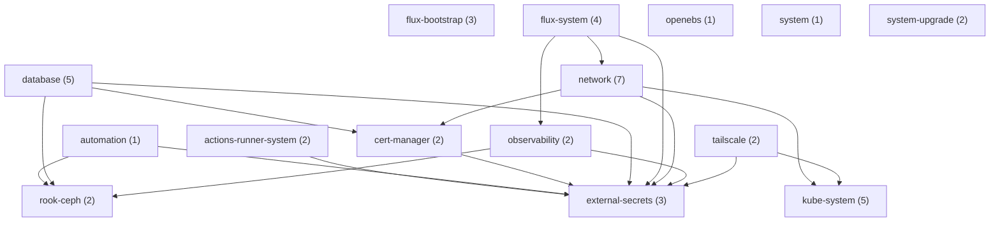

<details>
<summary>actions-runner-system (2)</summary>

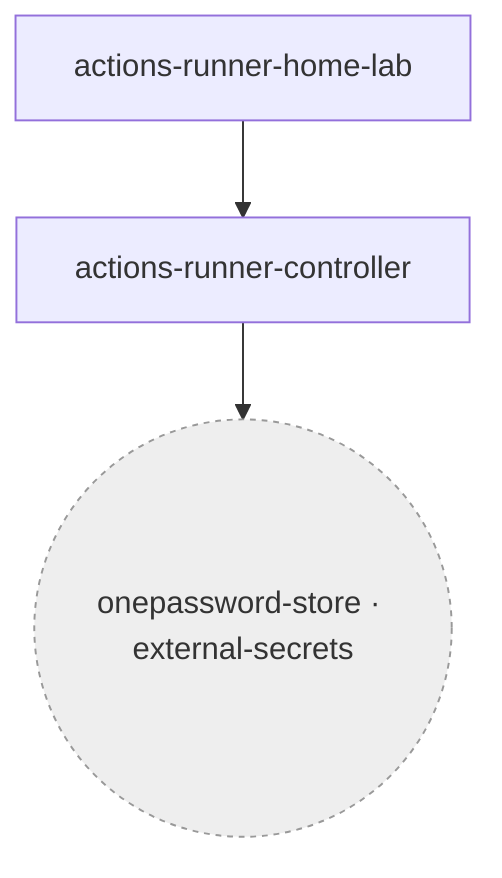

</details>

<details>
<summary>automation (1)</summary>

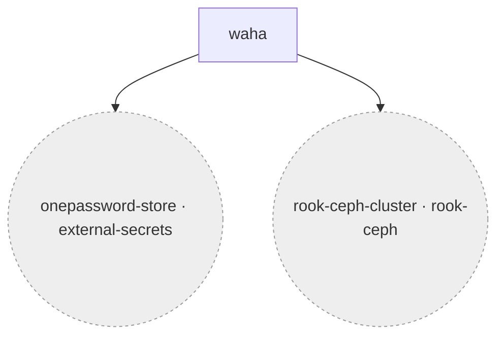

</details>

<details>
<summary>cert-manager (2)</summary>

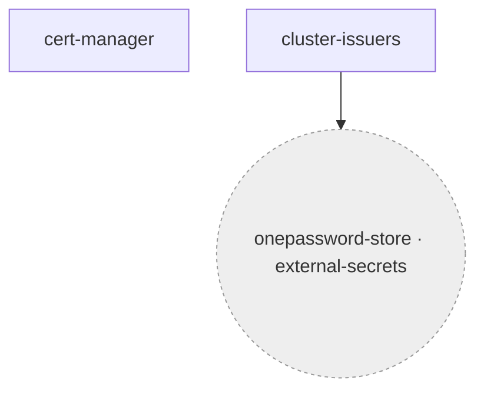

</details>

<details>
<summary>database (5)</summary>

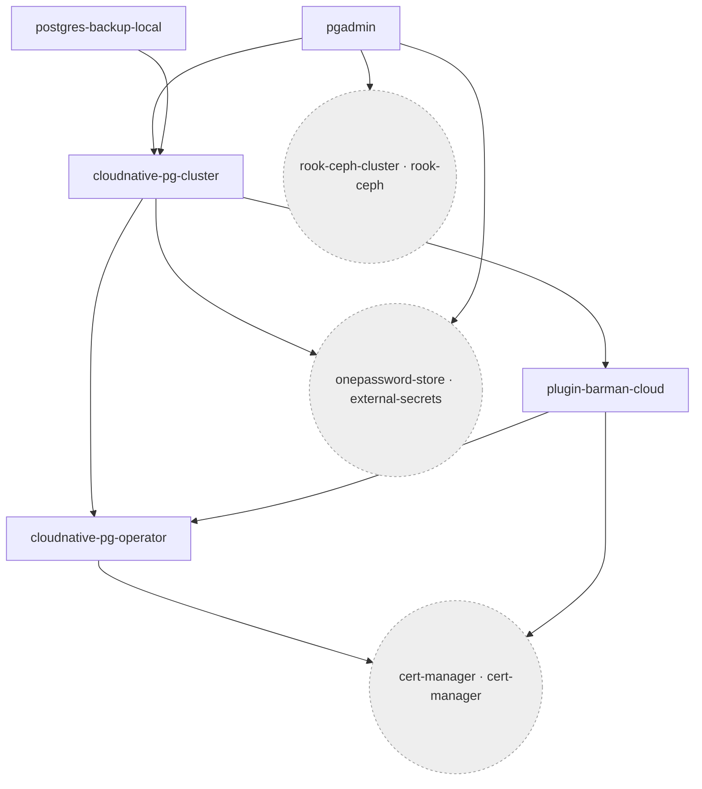

</details>

<details>
<summary>external-secrets (3)</summary>

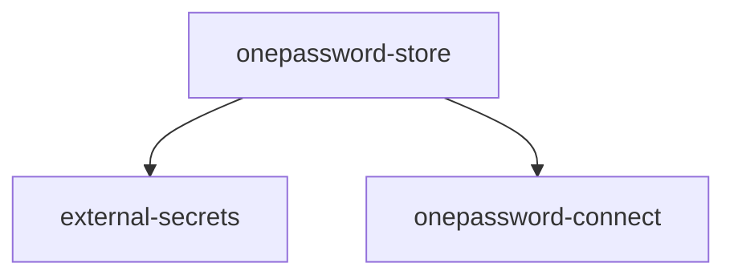

</details>

<details>
<summary>flux-bootstrap (3)</summary>

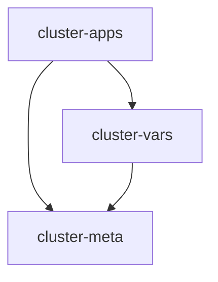

</details>

<details>
<summary>flux-system (4)</summary>

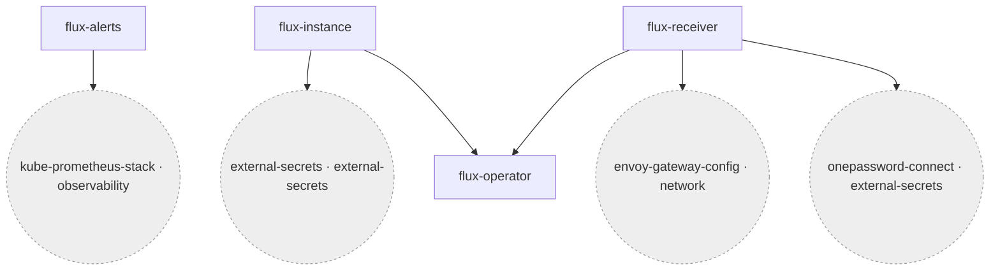

</details>

<details>
<summary>kube-system (5)</summary>

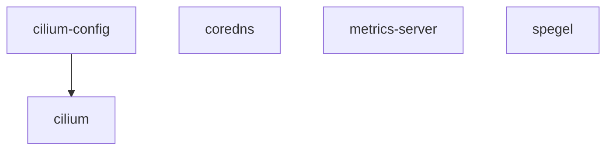

</details>

<details>
<summary>network (7)</summary>

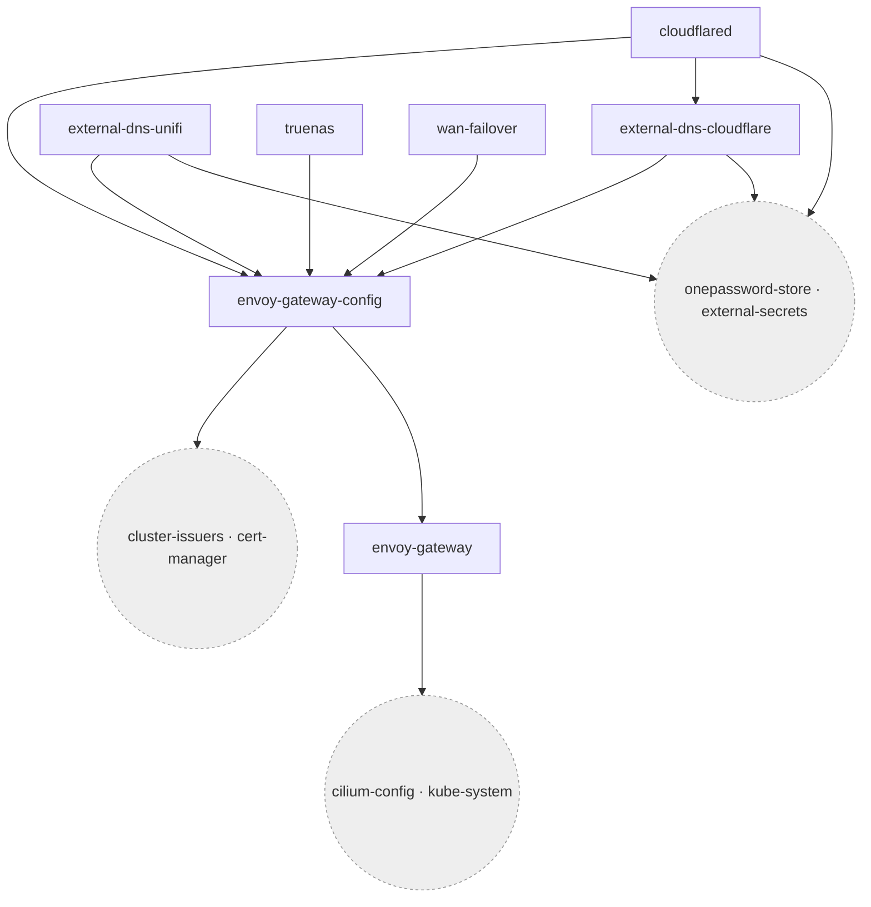

</details>

<details>
<summary>observability (2)</summary>

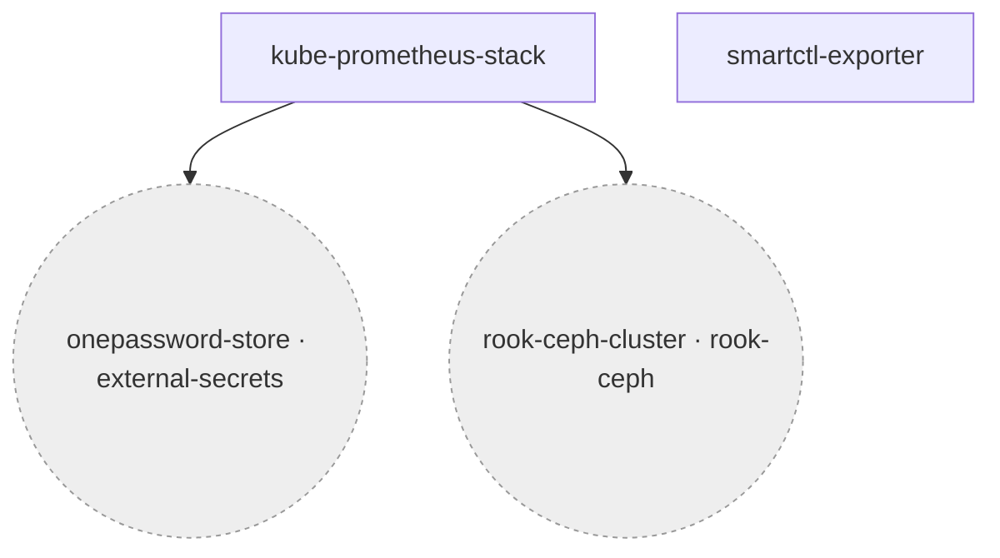

</details>

<details>
<summary>openebs (1)</summary>


</details>

<details>
<summary>rook-ceph (2)</summary>

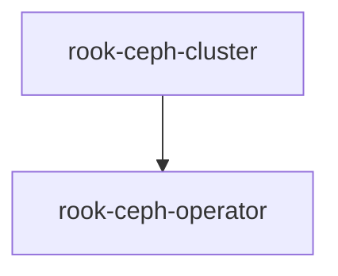

</details>

<details>
<summary>system (1)</summary>


</details>

<details>
<summary>system-upgrade (2)</summary>

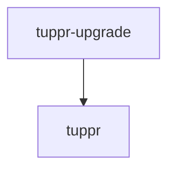

</details>

<details>
<summary>tailscale (2)</summary>

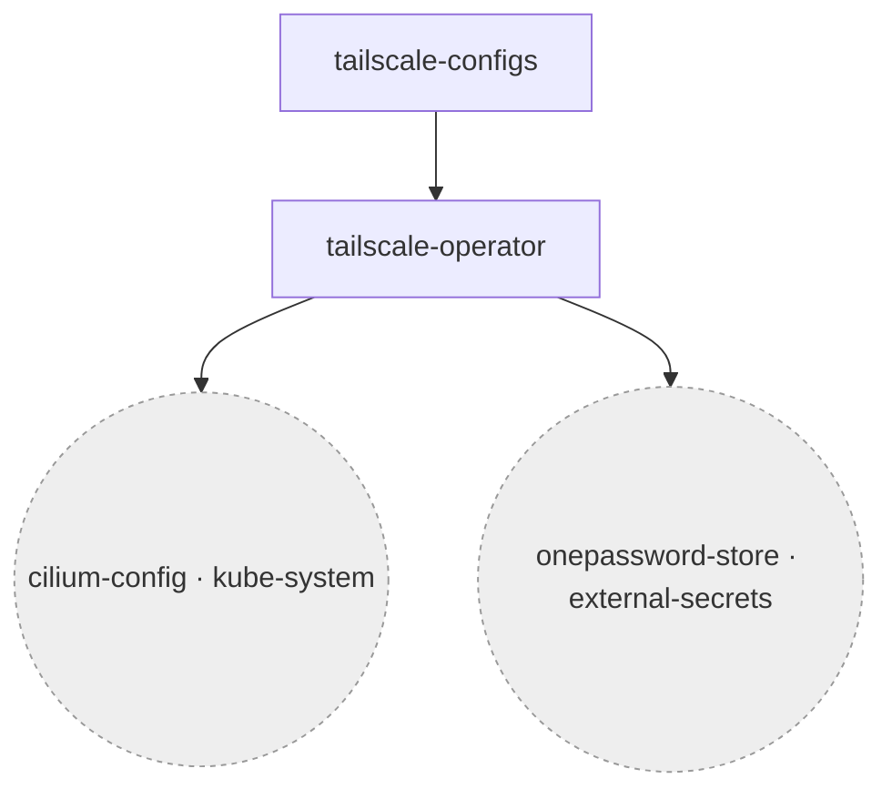

</details>

<!-- END: DEPENDENCY-GRAPH-AUTO -->

---

## GitOps Repository Audit

For a periodic audit of the repository's Flux configuration quality, schema validation results, security posture, and open recommendations, see **[REPO-AUDIT.md](REPO-AUDIT.md)**.

Re-run the audit after adding or removing major components; the commands are listed in the [How to Re-Audit](REPO-AUDIT.md#how-to-re-audit) section.

---

## Bootstrap Runbook

Step-by-step guide for bootstrapping the cluster from scratch or after a full reset. All commands run from the repo root inside the devcontainer.

### Phase 0 — Reset (re-bootstrap only)

> Skip on first bootstrap — nodes are already in maintenance mode after OS installation.

```bash
task talos:reset
```

Confirm the interactive prompt. The task wipes the `STATE` and `EPHEMERAL` Talos partitions on all three nodes and reboots them. The OS installation is preserved; no re-flashing is required.

Wait ~3–5 minutes, then poll until all nodes respond in maintenance mode:

```bash
task talos:wait-maintenance
```

Exits automatically once all three nodes return their Talos version.

> **Important**: `talsecret.sops.yaml` must **not** be regenerated on a running or previously-bootstrapped cluster. The CA certificates and bootstrap tokens it contains are baked into every node's machine config. The `gensecret` stage guards against accidental regeneration — it only generates the file if it does not already exist.

### Phase 1 — Bootstrap everything

First-time setup: fetch the SOPS age key from 1Password (needed to decrypt `talsecret.sops.yaml` during `genconfig`):

```bash
just bootstrap age-key
```

Then run the full bootstrap pipeline:

```bash
just bootstrap
```

Runs these stages in sequence:

| Stage | What it does |
|-------|-------------|
| `gensecret` | Generates `talsecret.sops.yaml` (skipped if it already exists) |
| `genconfig` | Renders `talconfig.yaml` → machine configs in `clusterconfig/` |
| `wipe-osds` | Wipes stale LVM/Ceph metadata from OSD disks (no-op if already clean) |
| `apply-talos` | Pushes configs to all nodes (`--insecure`, maintenance mode only) |
| `bootstrap-k8s` | Bootstraps etcd on the first control-plane node |
| `kubeconfig` | Fetches `kubeconfig` to repo root |
| `wait` | Polls until all nodes reach `NotReady` (k8s API up, CNI not yet running) |
| `namespaces` | Pre-creates all app namespaces from `kubernetes/apps/` |
| `resources` | Creates bootstrap secrets from 1Password (sops-age, 1password-connect, flux-github-app) |
| `crds` | Pre-installs CRDs from Flux-managed charts so Kustomization dry-runs pass |
| `apps` | Installs Cilium → CoreDNS → Spegel → cert-manager → flux-operator → flux-instance |

> **Note**: `apps` uses `helmfile sync`, not `helmfile apply`. The `apply` subcommand pre-diffs all releases in parallel and fails on `flux-instance` because the `FluxInstance` CRD does not exist until `flux-operator` finishes installing.

> **Why `NotReady` before `apps`?** Kubernetes requires a CNI plugin before the kubelet will report a node as `Ready`. Without one, the node's `NetworkPluginNotReady` condition is set and it stays in `NotReady` indefinitely. Cilium is this cluster's CNI — nodes only become `Ready` after the `apps` stage completes. This is expected behaviour.

**Expected duration**: ~15–20 minutes for the full pipeline.

Individual stages are callable independently (useful for re-running after a failure):

```bash
just bootstrap resources   # re-seed secrets only
just bootstrap crds        # re-apply CRD pre-bootstrap only
just bootstrap apps        # re-run helmfile sync only
```

Once `apps` completes, Cilium is running and nodes will transition to `Ready`. Poll until all three nodes are `Ready`:

```bash
task talos:wait-bootstrap
```

The `flux-github-app` secret is created during the `resources` stage (before Flux starts), so Flux can pull from the repo immediately on first reconcile. The companion ExternalSecret in `kubernetes/apps/flux-system/flux-instance/app/externalsecret.yaml` keeps this secret in sync with 1Password day-2.

To verify the secret exists:

```bash
kubectl get secret flux-github-app -n flux-system \
  -o jsonpath='{.data.githubAppID}' | base64 -d
```

### Phase 2 — Hand off to GitOps

```bash
git push    # push any uncommitted changes first
```

Flux polls the repository every 5 minutes. Verify reconciliation:

```bash
flux get all -A
kubectl get gitrepository,kustomization -A
```

All sources and Kustomizations should show `Ready = True`. The full sync path is:

```
flux-system GitRepository → cluster-meta Kustomization → cluster-vars Kustomization → cluster-apps Kustomization → <per-app Kustomizations>
```

### Day-2 Config Changes

Use this when modifying `talconfig.yaml` on a running cluster (patch changes, node settings, version bumps) — **not** a full re-bootstrap.

```bash
# 1. Edit talos/talconfig.yaml as needed, then regenerate machine configs:
task talos:genconfig

# 2a. Push to all running nodes (repeat per node):
task talos:apply IP=10.60.0.201
task talos:apply IP=10.60.0.202
task talos:apply IP=10.60.0.203
task talos:apply IP=10.60.0.204
task talos:apply IP=10.60.0.205

# 2b. Or push to a single running node:
task talos:apply IP=10.60.0.201
```

> `talos:apply` defaults to authenticated mode (mutual TLS via talosconfig) for **running** nodes.
> Pass `INSECURE=true` only during **bootstrap/maintenance mode**: `task talos:apply IP=x INSECURE=true`.
> `talos:apply-all` always uses `--insecure` and is for **bootstrap only**.
> `talos:genconfig` is run automatically by the `genconfig` stage of `just bootstrap`. For day-2 edits you call it directly — `just bootstrap` is for first-boot only.

---

### Troubleshooting

| Symptom | Likely cause | Fix |
|---------|-------------|-----|
| `talosctl version --insecure` times out | Node still rebooting | Wait and retry |
| `apply-all` fails with `connection refused` | Node not yet in maintenance mode | Wait and retry |
| `apps` stage fails on `flux-instance` | Running `helmfile apply` instead of `sync` | Always use `just bootstrap apps` |
| Flux shows `Secret not found` | `flux-github-app` secret missing | Run `just bootstrap resources` |
| Flux shows `unable to clone` or `401 Unauthorized` | GitHub App not installed on repo, or credentials rotated | Verify app is installed at github.com/settings/installations; re-run `just bootstrap resources` to refresh secrets |
| `talosctl upgrade` installs to wrong disk | `upgrade` always targets the current system disk — `installDiskSelector` is ignored | Boot from Talos ISO → `task talos:apply IP=x INSECURE=true` |
| Installer refuses to touch disk with existing partitions | `wipe: false` (default) — installer skips non-Talos disks | Add temporary `machine: install: wipe: true` node patch; remove after migration |
| `talosctl upgrade` fails with `too_many_pings` / `ENHANCE_YOUR_CALM` | Client version newer than server — gRPC keepalive rate-limited | `mise install talosctl@<server-version>` then `mise exec talosctl@<version> -- talosctl upgrade ...` |
| NVMe device names swap after adding a drive (`nvme0n1` ↔ `nvme1n1`) | PCIe enumeration order changes with number of drives | Use `installDiskSelector: model: "<model>"` instead of `installDisk: /dev/nvme*` |
| `kubeconfig` accidentally deleted | File is gitignored, not in repo | Run `task talos:kubeconfig` — fetches it live from the Talos API (requires `talos/clusterconfig/talosconfig` and a reachable control-plane node) |
| Node stuck `STAGE: Booting READY: False` after ISO maintenance boot; etcd shows dual peer URLs (`<dhcp-ip>:2380` + `<static-ip>:2380`) | Switch ports in LACP mode during ISO boot → node gets temporary DHCP IP and records it as etcd peer URL; once LACP restored the DHCP IP vanishes and learner promotion stalls | 1. `talosctl etcd remove-member <stale-id> --nodes <other-node>` — node re-adds itself with correct peer URL only; 2. Wait for raft indexes to converge (`talosctl etcd status`); 3. Download etcdctl matching etcd version; extract certs via `talosctl read /system/secrets/etcd/{ca,admin}.{crt,key} --nodes <leader>`; 4. `ETCDCTL_API=3 etcdctl --endpoints https://<leader>:2379 --cacert ca.crt --cert admin.crt --key admin.key member promote <member-id-hex>` |
| Cilium DaemonSet gone; pods stuck `ContainerCreating`; Flux controllers not starting | CNI deleted — all regular pods (including Flux controllers) need Cilium to receive a network sandbox | Manual reinstall in order: `helm install cilium` → `helm install coredns` → delete stale flux-instance Helm secrets → `helm install flux-instance`; see QA.md *"How do I recover when Cilium and CoreDNS are both gone simultaneously?"* |
| `flux-instance` in `uninstalling` state; Flux CRDs missing; FluxInstance CR gone | Stale Helm release secret holds release in `uninstalling`; FluxInstance CRD deletion took the CR and all controllers offline | Delete stale secrets (`kubectl get secrets -n flux-system \| grep sh.helm.release.v1.flux-instance`); then `helm install flux-instance`; see QA.md *"flux-instance is stuck uninstalling..."* |
| HelmRelease shows `Stalled: MissingRollbackTarget` | `cleanupOnFail: true` removed resources from a failed first install, leaving no revision for `rollback` remediation | Seed revision 1: `helm install --no-hooks`; then `flux reconcile helmrelease`; see QA.md *"A HelmRelease is Stalled with MissingRollbackTarget"* |
| Longhorn namespace stuck `Terminating`; `kubectl patch` returns `Internal error: failed calling webhook` | `ValidatingWebhookConfiguration/longhorn-webhook-validator` (cluster-scoped) survives namespace deletion and blocks all Longhorn CRD mutations | Delete both webhook configs: `kubectl delete validatingwebhookconfiguration longhorn-webhook-validator && kubectl delete mutatingwebhookconfiguration longhorn-webhook-mutator`; then patch finalizers on all 9 Longhorn CRD types; see QA.md *"Longhorn finalizer patches fail..."* |
| OCIRepository status shows `DENIED: requested access to the resource is denied` | Chart does not publish OCI artifacts; `OCIRepository` used instead of `HelmRepository` | Delete the `OCIRepository`; create a `HelmRepository` with the chart's `https://` URL; update `HelmRelease` to use `chart.spec.sourceRef` (not `chartRef`); see QA.md *"How do I choose between HelmRepository and OCIRepository?"* |
| ESO / ExternalSecrets failing after cluster recovery; `onepassword-connect` Secret not found | Bootstrap secret `onepassword-connect-secrets` in `external-secrets` was deleted during a cascade; it is NOT managed by ExternalSecrets | `just bootstrap resources` — recreates all bootstrap secrets (sops-age, 1password-connect, flux-github-app) imperatively; must be run before any ExternalSecret in the cluster can resolve |

---

## Secrets

| Secret type | Mechanism | Location |
|-------------|-----------|----------|
| Talos secrets | SOPS + age | `talos/talsecret.sops.yaml` |
| Flux GitHub App credentials | Kubernetes secret (imperative at bootstrap, then ESO-managed) | `flux-system/flux-github-app` |
| 1Password Connect bootstrap credential | Kubernetes secret (imperative, via `just bootstrap resources`) | `external-secrets/onepassword-connect-secrets` — **NOT** managed by ExternalSecrets; it is the credential for the secret manager itself; must be recreated manually after any cluster recovery |
| Application secrets | External Secrets Operator + 1Password Connect | `kubernetes/apps/` |

**Talos secret generation (`talsecret.sops.yaml`)** — generated once via `talhelper gensecret` and encrypted in-flight through `sops` before touching disk. This file must never be regenerated on a running cluster: the CA certificates and bootstrap tokens it contains are baked into every node's machine config. Regenerating invalidates all nodes and requires re-applying configs. The `gensecret` stage guards against accidental regeneration with `[ -f talsecret.sops.yaml ] || ...`. To intentionally start fresh, `rm talos/talsecret.sops.yaml` explicitly first.

See `CLAUDE.md` for full secrets management detail and SOPS rules.

---

## Key Architectural Decisions

- **No kube-proxy**: Cilium replaces it entirely (`proxy.disabled: true` in cluster patch)
- **No built-in CoreDNS**: Talos `coreDNS.disabled: true`; CoreDNS is a HelmRelease in `kube-system`
- **etcd on management subnet only**: `advertisedSubnets: ["10.60.0.0/24"]` keeps etcd off storage VLAN
- **NFS defaults**: `nfsvers=4.2`, `nconnect=16`, `hard=True`, `noatime=True` (set in machine files patch)
- **Container runtime**: unprivileged ports + ICMP enabled; image layers not discarded (cache efficiency)
- **Upgrade path**: tuppr (home-operations/tuppr) — `TalosUpgrade` + `KubernetesUpgrade` CRDs in `system-upgrade` namespace; Renovate opens PRs per minor version; tuppr performs rolling node-by-node upgrades via `talosctl upgrade-k8s` (sequential, safe for v1.35+)
  - **Preferred method**: merge the Renovate PR; tuppr handles the full upgrade automatically — no manual steps required and avoids the `KubernetesUpgrade` CRD mismatch problem (see QA.md)
  - **Pre-upgrade check**: always run `talosctl upgrade-k8s --to <version> --dry-run` before merging; flags removed feature gates and deprecated API versions before any change is made
  - **If upgrading manually** (apiserver only, via `talosctl patch mc`): use strategic merge form (`{"cluster":{"apiServer":{"image":"..."}}}`) — JSON RFC 6902 patches are rejected for multi-doc machine configs (talhelper v1.12+); wait for 2-minute stable PID per node before patching the next
  - **After any manual `upgrade-k8s`** that advances the cluster ahead of Git: delete the `KubernetesUpgrade` resource before Flux reconcile (`kubectl delete kubernetesupgrade kubernetes -n system-upgrade`) — otherwise tuppr sees CURRENT > TARGET and starts failing downgrade jobs
